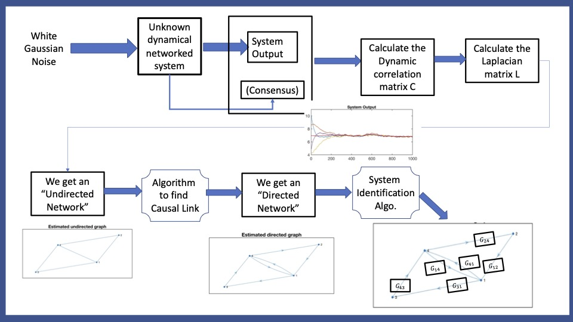

# Causal Link Discovery With Network Topology Identification.

Reconstructing the causal relations behind the phenomena  we  observe  is  a  fundamental  problem  in  all  fields  of science. Our work till now mainly consist of constructing the network topology, undirected network, but there are various phenomena in nature which are causal in nature such as in earth  system  science and neuroscience. So. we add to our problem the dimension of causality too, which makes this challenging and practical. We have taken baby steps in this directions and extended upon our work on " Noise Based Network Topology Identification" by adding causality discovery algorithm.   
In control systems, the causality is associated with input and output signal. The input and output signal are related by system transfer function. We also try to find the relation between input and output using conventional parameter estimation methods.  

# STRATEGY 
 
