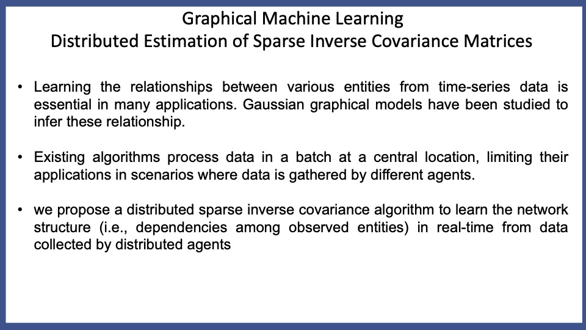
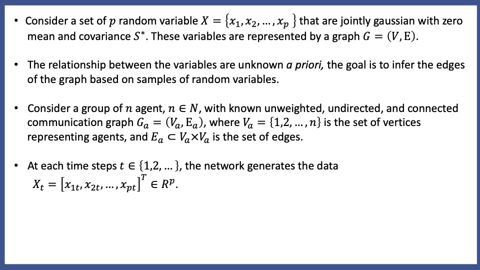
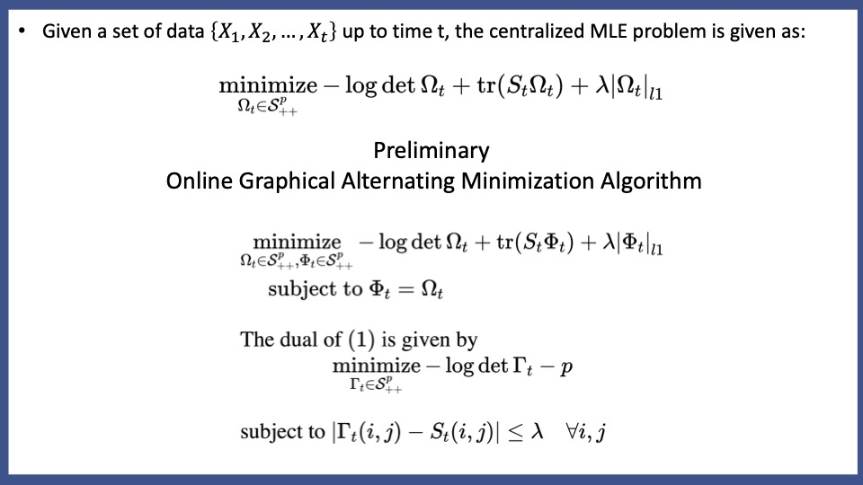
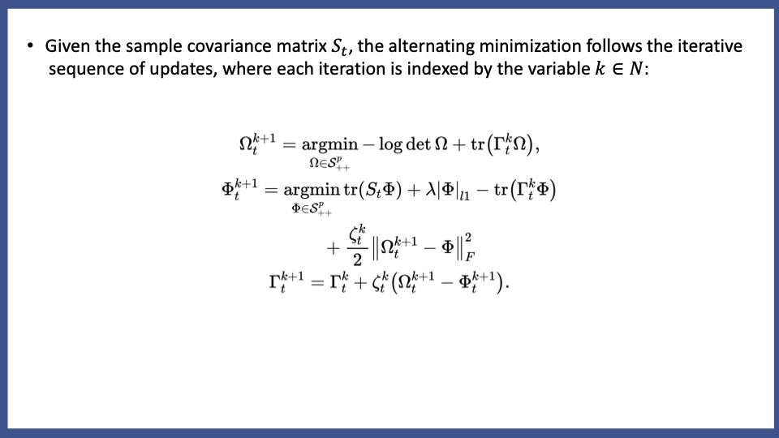
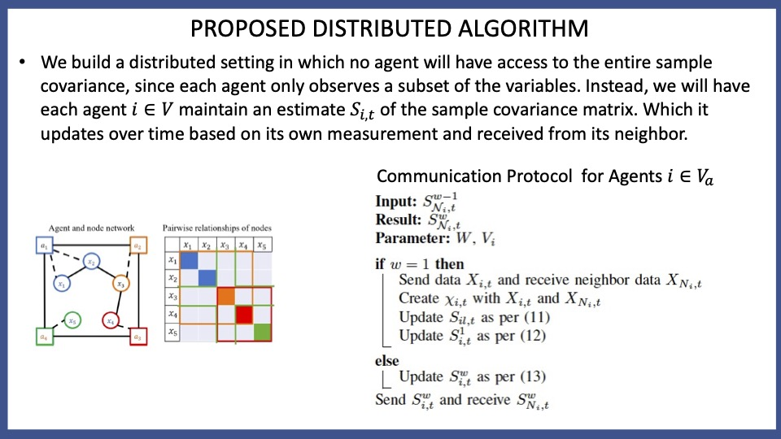
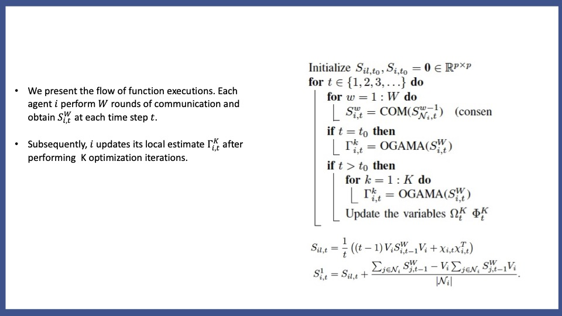

# Graphical Machine Learning
Our work on "Using noise for uncovering the network connection" brought us to the conclusion that the laplacian matrix is inversely proportional to the covariance matrix. But this result very closely related to the estimation of the inverse of covariance matrix in maximum likelihood formulation. The noise based estimation, estimates laplacian matrix from the sample covariance matrix, which is suboptimal. We move forward with the motivation to improve upon this and found that Graphical LASSO algorithms are well suited for such problems.   
# STRATEGY and RESULTS

