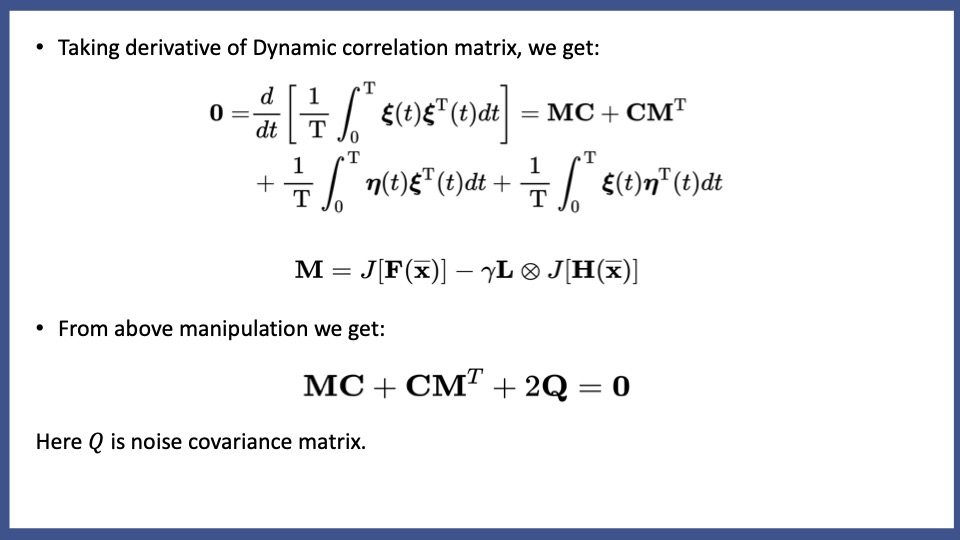

# Noise Helps in Uncovering the Hidden Topology of the Coupled Oscillator Network

We find that with the help of noise, in general it becomes possible to identify interactions based solely on the correlations among measured time series of nodes. In this sense, we say that noise uncovers the hidden topology of the coupled oscillator network.

# Strategy of Solving Problem

# Problem Formulation
 
 
 
 
 
# RESULT
 

